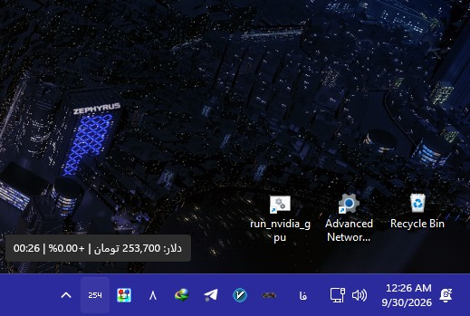

<div dir="rtl">

# RateTray

Live currency, gold and silver prices next to the Windows clock.

<p align="center">
  
</p>

## قابلیت‌ها

- **آیکون عددی زنده در نوار وظیفه:** مثلاً `254` یعنی ۲۵۴ هزار تومان
  - بدون پس‌زمینه؛ فقط عدد، هم‌سبک ساعت ویندوز (روشن یا تیره، خودکار)
  - زیر ۱۰ هزار تومان با یک رقم اعشار (مثلاً `5.2`)، بالای یک میلیون تومان با پسوند `M` (مثلاً `25M`) و برای دلاری‌ها با پسوند `K` (مثلاً بیت‌کوین `84K`)
- **۲۴ نماد در ۵ بخش:** «طلا و نقره» (طلای ۱۸ عیار، نقره ۹۹۹)، «ارزها» (دلار، یورو، دلار کانادا، لیر ترکیه، پوند انگلیس، درهم امارات، یوان چین، ین ژاپن)، «ارز دیجیتال» (بیت کوین، اتریوم، تتر، ترون، ریپل، کاردانو، دوج کوین، سولانا)، «نفت» (برنت) و «فلزات پایه» (آلومینیوم، مس، سرب، روی، نیکل) — هر ردیف با نماد، قیمت، درصد تغییر و ساعت، در ستون‌های کاملاً تراز؛ بالای هر بخش واحدش نوشته شده (تومان یا دلار). لیست بلند، اسکرول می‌شود و سربرگ هر بخش موقع اسکرول ثابت می‌ماند
- **انتخاب با یک کلیک:** کلیک روی هر ردیف، همان را در نوار وظیفه نشان می‌دهد (نمادش سبز می‌شود)
- **به‌روزرسانی خودکار و موازی** با فاصله دلخواه (پیش‌فرض هر ۱ دقیقه) + دکمه «بروزرسانی» دستی برای همه موارد
- **کپی قیمت** با یک کلیک، **اجرای خودکار با ویندوز** با سوییچ، پیام‌های خطای فارسی و ساده
- **شروع فوری:** آخرین قیمت‌ها ذخیره می‌شوند تا باز شدن بعدی معطل اینترنت نماند

## فناوری‌ها

- [Tauri v2](https://tauri.app/) با بک‌اند Rust
- [Vite](https://vite.dev/) و TypeScript — بدون فریم‌ورک فرانت‌اند، فقط HTML و CSS و TS
- منبع قیمت‌ها: [tgju.org](https://tgju.org) (بازار آزاد، به ریال)

## نصب و اجرا

### پیش‌نیازها (فقط برای ساخت از سورس)

- Rust (از [rustup.rs](https://rustup.rs/))
- Node.js 18+
- WebView2 Runtime (روی ویندوز ۱۰ و ۱۱ معمولاً از قبل نصب است)
- Visual Studio با C++ Build Tools

### اجرای نسخه آماده

فایل `RateTray_0.1.0_x64-setup.exe` را نصب کنید.

### اجرا در حالت توسعه

```powershell
npm install   # فقط بار اول
npm run tauri dev
```

### ساخت نسخه نهایی

```powershell
npm run tauri build
```

خروجی‌ها در `src-tauri\target\release\`:

- `bundle\nsis\RateTray_0.1.0_x64-setup.exe` — نصب‌کننده (پیشنهادی)
- `bundle\msi\RateTray_0.1.0_x64_en-US.msi` — نصب‌کننده MSI
- `RateTray.exe` — اجرا بدون نصب

## نحوه کار

| بخش | فایل | توضیح |
|---|---|---|
| دریافت قیمت | `src-tauri/src/lib.rs` | گرفتن HTML صفحه هر نماد در tgju و استخراج قیمت با regex؛ همه موارد به‌صورت موازی |
| انتخاب نماد | `src-tauri/src/lib.rs` | فرمان `set_currency` + رویداد `prices-updated`؛ انتخاب در فایل تنظیمات می‌ماند |
| رندر آیکون | `src-tauri/src/icon.rs` | فونت پیکسلی ۴×۶ روی بوم شفاف ۳۲×۳۲؛ اعشار و پسوندهای `M` و `K`، مبدأ زوج برای تیزی کامل و رنگ تطبیقی با نوار وظیفه |
| پنجره | `index.html` + `src/main.ts` + `src/styles.css` | لیست ردیف‌های کلیک‌شدنی با شبکه‌بندی ثابت |
| بستن پنجره | `src-tauri/src/lib.rs` | بستن یعنی مخفی شدن؛ برنامه تا «خروج» از منو زنده می‌ماند |

## نکته ویندوز ۱۱

اگر عدد کنار ساعت دیده نشد، پشت فلش `^` (آیکون‌های مخفی) است؛ یک بار آن را به نوار وظیفه بکشید تا همیشه دیده شود.

## سازنده

[Rez Fuladpanjeh](https://github.com/fuladpanje)

</div>
